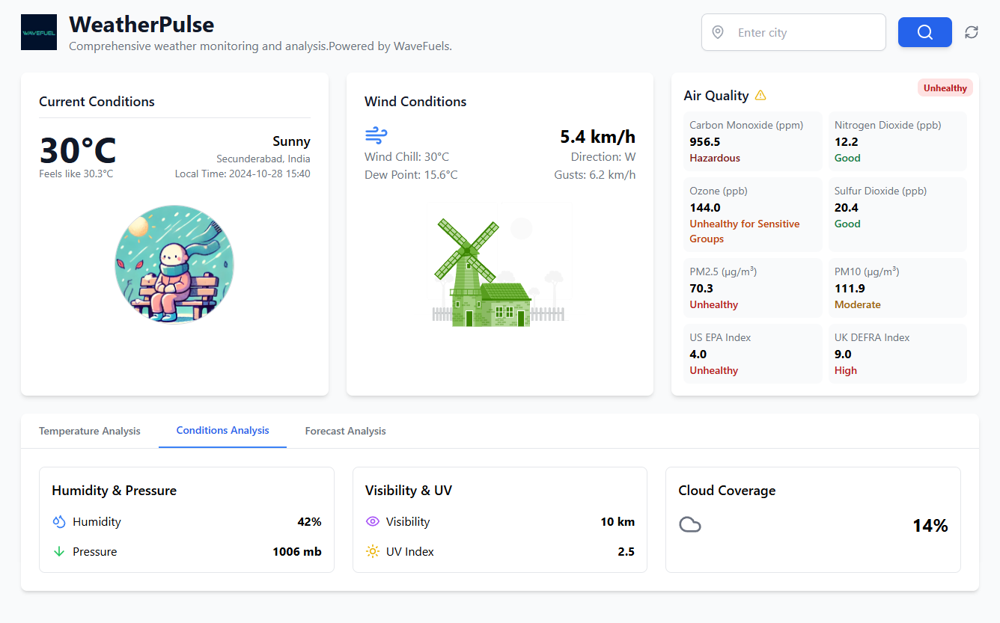
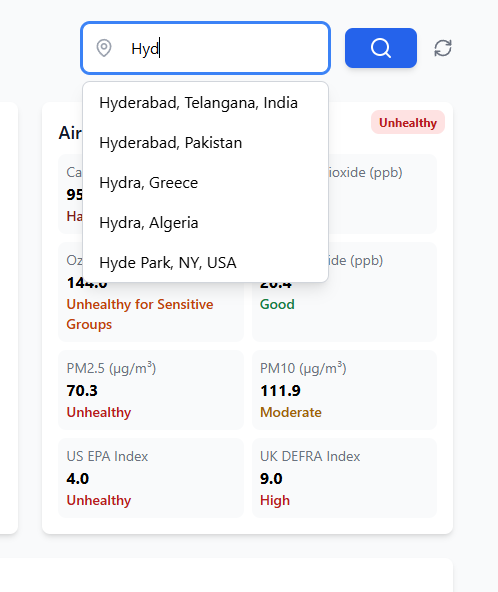
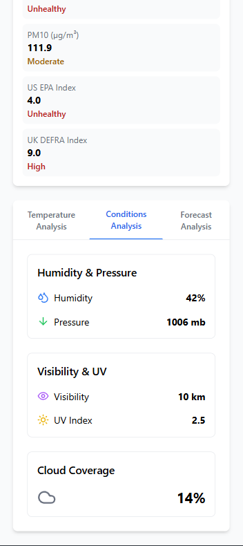

# WeatherPulse 🌦️

WeatherPulse is a live weather monitoring application that provides real-time weather data and historical data from the past 3 days. The app features a dynamic user interface built with Vite+React and TailwindCSS for styling, while the backend is powered by Express and MongoDB to handle WebSocket and HTTP requests.

## Table of Contents

- [Features](#features)
- [Backend Overview](#backend-overview)
- [Frontend Overview](#frontend-overview)
- [Deployment](#deployment)
- [Screenshots](#screenshots)
- [Technologies Used](#technologies-used)

---
## Features

- **Real-Time Data**: Receive live weather data through WebSockets.
- **Historical Data**: Fetch weather data from the past 3 days using HTTP requests.
- **City Suggestions**: Use Google Maps API for suggesting cities as the user types.
- **Responsive Design**: View weather data seamlessly on both mobile and desktop devices.
- **Geolocation**: Automatically fetch the user's location to provide weather data.
- **Deployed**: Backend hosted on Render, frontend on Netlify.

---
## Backend Overview
The backend of **WeatherPulse** is built using **Express.js** and handles two types of requests:

1. **HTTP Request (GET /api/weather/history/:city)[Under development]**: 
   - Fetches the historical weather data for the last 3 days.
   - Data is stored in **MongoDB** and retrieved to provide past weather information.

2. **WebSocket (wss:https://weatherpulse-vzo1.onrender.com)**: 
   - Sends real-time weather data to connected clients.
   - Clients can subscribe to receive live updates for specific cities.

### MongoDB Integration:
   - Past weather data is stored in **MongoDB**, and the HTTP API retrieves the past 3 days' data for the requested city.

---
## Frontend Overview

The frontend of **WeatherPulse** is built with **Vite + React** and styled using **TailwindCSS**. It provides a responsive and seamless user experience.

### Key Features:
1. **Google Maps API**:
   - **City Suggestions**: As the user types in the search box, cities are suggested using the Google Maps Places API.
   - **Geolocation**: Automatically fetches the user's location and displays weather data for their current city.

2. **Responsive UI**:
   - Fully responsive UI, adapting seamlessly between mobile and desktop views.

3. **WebSocket Integration**:
   - The app handles live weather updates through WebSockets, displaying real-time data to the user.

---

## Deployment

- **Backend**: Deployed on [Render](https://weatherpulse-vzo1.onrender.com), ensuring reliable API and WebSocket performance.
- **Frontend**: Deployed on [Netlify](https://wavefuels-weather-pulse.netlify.app/), providing fast and scalable hosting for the client-side React app.

---

## Screenshots

### Laptop View

### Mobile View

